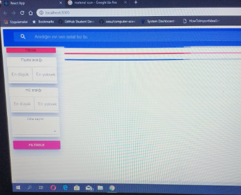
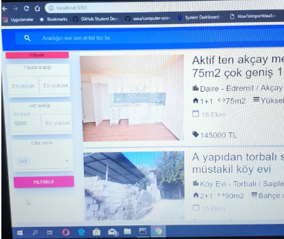

NOT: If you can not run on your local computer, you can be check from this from http://142.93.167.105:3000/ 

This project was bootstrapped with [Create React App](https://github.com/facebook/create-react-app).

Below you will find some information on how to perform common tasks.<br>
You can find the most recent version of this guide [here](https://github.com/facebook/create-react-app/blob/master/packages/react-scripts/template/README.md).

## Table of Contents

- [Sending Feedback](#sending-feedback)
- [Folder Structure](#folder-structure)
- [Images](#images)
- [Available Scripts](#available-scripts)
  - [npm install](#npm install)
  - [npm start](#npm-start)
  - [npm test](#npm-test)
  - [npm run build](#npm-run-build)
  - [npm run eject](#npm-run-eject)
- [Supported Browsers](#supported-browsers)
- [Installing a Dependency](#installing-a-dependency)
- [Importing a Component](#importing-a-component)
- [Something Missing?](#something-missing)


## Sending Feedback

We are always open to [your feedback](https://github.com/gencelo/jetagent-ui/issues).

## Folder Structure

After creation, your project should look like this:

```
my-app/
  README.md
  node_modules/
  package.json
  public/
    index.html
    favicon.ico
  src/
    App.css
    App.js
    App.test.js
    index.css
    index.js
    logo.svg
    components/
      LeftMenu.js
      Posts.js
      SearchBar.js
```

For the project to build, **these files must exist with exact filenames**:

- `public/index.html` is the page template;
- `src/index.js` is the JavaScript entry point.

## Images






## Available Scripts

In the project directory, you can run:

### `npm install`

This command installs a package, and any packages that it depends on.

### `npm start`

Runs the app in the development mode.<br>
Open [http://localhost:3000](http://localhost:3000) to view it in the browser.

The page will reload if you make edits.<br>
You will also see any lint errors in the console.

### `npm test`

Launches the test runner in the interactive watch mode.<br>
See the section about [running tests](#running-tests) for more information.

### `npm run build`

Builds the app for production to the `build` folder.<br>
It correctly bundles React in production mode and optimizes the build for the best performance.

The build is minified and the filenames include the hashes.<br>
Your app is ready to be deployed!

See the section about [deployment](#deployment) for more information.

### `npm run eject`

**Note: this is a one-way operation. Once you `eject`, you can’t go back!**

If you aren’t satisfied with the build tool and configuration choices, you can `eject` at any time. This command will remove the single build dependency from your project.

Instead, it will copy all the configuration files and the transitive dependencies (Webpack, Babel, ESLint, etc) right into your project so you have full control over them. All of the commands except `eject` will still work, but they will point to the copied scripts so you can tweak them. At this point you’re on your own.

You don’t have to ever use `eject`. The curated feature set is suitable for small and middle deployments, and you shouldn’t feel obligated to use this feature. However we understand that this tool wouldn’t be useful if you couldn’t customize it when you are ready for it.

## Supported Browsers

By default, the generated project supports all modern browsers.<br>
Support for Internet Explorer 9, 10, and 11 requires [polyfills](https://github.com/facebook/create-react-app/blob/master/packages/react-app-polyfill/README.md).

## Installing a Dependency

The generated project includes React and ReactDOM as dependencies. It also includes a set of scripts used by Create React App as a development dependency. You may install other dependencies (for example, React Router) with `npm`:

```sh
npm install --save react-router-dom
```

Alternatively you may use `yarn`:

```sh
yarn add react-router-dom
```

This works for any library, not just `react-router-dom`.

## Something Missing?

If you have ideas for more “How To” recipes that should be on this page, [let us know](https://github.com/gencelo/jetagent-ui/issues)
